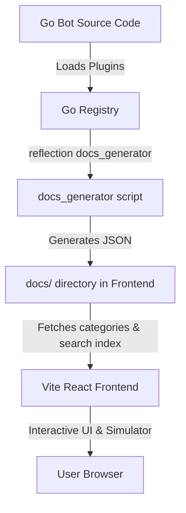

# Shiroine Bot Command Documentation System

A premium, dynamic, and automated command documentation registry for Shiroine Bot. The system is split into two components: an automated Go-based generator that extracts metadata directly from the bot's plugin registry, and a modern, high-performance React frontend that serves as the visual interface.

---

## Architecture Overview



1. **Backend Generator (Go)**: Iterates over the bot's plugin registry via reflection. It exports detailed command metadata (excluding unexported properties and code handlers) to JSON files. This ensures that any new plugin fields added to the struct are automatically generated without modifying the generator code.
2. **Frontend Viewer (React + Vite + TypeScript)**: Reads the statically generated JSON files dynamically. Uses client-side hash routing, meaning it can be deployed on any static hosting platform without complex server redirect configurations.

---

## Features

- 🌌 **Premium Dark UI**: Built with a sleek backdrop glassmorphism interface.
- 🌓 **Theme Toggle**: Switch between Dark Mode (default) and Light Mode.
- 🔍 **Algolia-Style Instant Search (Ctrl+K)**: Instant overlay searching by command name, aliases, categories, and tags with full keyboard navigation (arrows and enter keys).
- 📱 **Mobile Responsive**: Optimised grid layouts and modals for all mobile screens.
- 💬 **WhatsApp Simulated Output bubble**: Previews simulated WhatsApp text bubble replies for commands like `tiktok` or `ytmp3`.
- 📋 **Copy to Clipboard**: Quick-copy buttons for usage syntax and examples.
- 💖 **Favorites & Recently Viewed**: Custom bookmarking saved in browser LocalStorage.
- ⚡ **Skeleton Loading & Fallbacks**: Smooth content reveals during fetch requests.

---

## Installation & Setup

### Step 1: Generate JSON Data from the Go Backend

First, generate the registry data from the `shiro` bot repository:

1. Navigate to the `shiro` bot project directory.
2. Run the docs generator tool, pointing the output to the frontend's `public/docs` directory:
   ```bash
   go run cmd/docs_generator/main.go -out ../shiroine-docs/public/docs
   ```
3. This creates all schema files inside `shiroine-docs/public/docs/`.

### Step 2: Install & Run the Frontend

1. Navigate to the `shiroine-docs` directory.
2. Install the package dependencies:
   ```bash
   npm install
   ```
3. Start the local development server:
   ```bash
   npm run dev
   ```
4. Open the link displayed in your terminal (usually `http://localhost:5173`) to view the documentation.

---

## Build & Production Deployment

To bundle the application for production:

```bash
npm run build
```
This compiles the application and copies the generated `docs/` data folder into the static output folder (`dist/`). You can deploy the contents of the `dist/` directory directly to any static host.

### Supported Platforms

Due to the use of relative base paths and hash routing, the project runs out-of-the-box on:
- **Vercel**
- **Netlify**
- **GitHub Pages** (runs cleanly under subfolders like `username.github.io/repo/`)
- **Cloudflare Pages**
- **Traditional Static Web Server (Nginx / Apache)**: Drop the `dist` directory onto your static directory root.
- **Self-Hosted static server**: Run `npx serve dist` (or similar node helper) to start a local static server.
